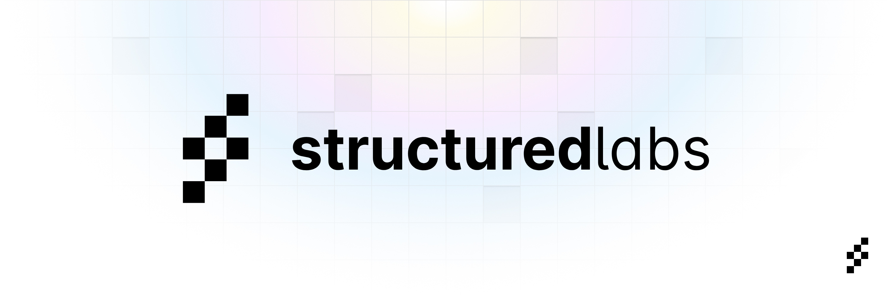

  

# **Structured Labs Coding Assessment Guide**

---

## [⭐ Step 0: Show some support! Star Preswald on GitHub](https://github.com/StructuredLabs/preswald)

## https://github.com/StructuredLabs/preswald

---

## 📦 1. Setup environment

* Please use Google Chrome to complete this assessment.

1. Go to [https://app.preswald.com](https://app.preswald.com)  
2. Sign in using your GitHub account  
3. Click **"+ New project"** to create a fresh workspace  
4. Upload the provided CSV file via the **Upload** button

---

### **2. Choose a Dataset**

Select/download a dataset from any of these sources:

- [Kaggle Datasets](https://www.kaggle.com/datasets)
- [Data.gov](https://www.data.gov/)
- [Open Data Repositories](https://github.com/awesomedata/awesome-public-datasets)
- Any csv (e.g., weather, finance, sports stats)

Place your dataset in the data/ folder of your project.

---

### **3. Implement Your Preswald App**

Modify \`hello.py\` to include the following:

1. **Load the dataset**
        
    \`\`\`   
    from preswald import connect, get_df
        
    connect()  # Initialize connection to preswald.toml data sources
    df = get_df("my_dataset")  # Load data
    \`\`\`

2. **Query or manipulate the data**
            
    \`\`\`
    from preswald import query
        
    sql = "SELECT * FROM my_dataset WHERE value > 50"
    filtered_df = query(sql, "my_dataset")
    \`\`\`

3. **Build an interactive UI**

    \`\`\`
    from preswald import table, text
    
    text("# My Data Analysis App")
    table(filtered_df, title="Filtered Data")
    \`\`\`

    - Add user controls:

    \`\`\`
    from preswald import slider, view
    threshold = slider("Threshold", min_val=0, max_val=100, default=50)
    table(df[df["value"] > threshold], title="Dynamic Data View")
    \`\`\`

4. **Create a visualization**

    \`\`\`
    from preswald import plotly
    import plotly.express as px
    
    fig = px.scatter(df, x="column1", y="column2", color="category")
    plotly(fig)
    \`\`\`

### 🔹 Add Other Widgets

Add other widgets to your app. Reference the docs here: [Preswald SDK](https://docs.preswald.com/)

---

## 👀 4. Preview Your App

Use the **Preview** tab in the IDE to view your app.

---

## 🚀 5. Get a Shareable Link

1. Generate an API key in: **Organization > Manage > Settings > API Keys**
2. Deploy your app using the Share button
    - Enter your **GitHub username** and **API key**
4. View the status of the deployment in the **Apps** tab

After deploying, you'll get a shareable public link. Save this for submitting your assessment.

---

## 🎁 (Bonus) Contribute to Preswald OSS!

👉 Check out our [open GitHub issues](https://github.com/StructuredLabs/preswald/issues?q=is%3Aissue+is%3Aopen) and submit a PR to the core Preswald framework.

Pick one, fork the repo, build the solution, and open a pull request. [Contributing Guide](https://github.com/StructuredLabs/preswald/blob/main/CONTRIBUTING.md)

---

## 📤 Submit your finished app ➡️ https://www.preswald.com/fizzbuzz 
